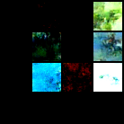
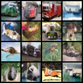
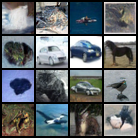
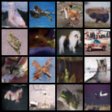
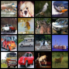
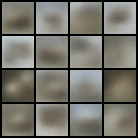
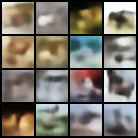
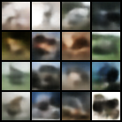

# Deep Generative Models

From-scratch implementations of **VAE** and **DDPM**, trained and evaluated on MNIST and CIFAR-10.

| Model | Dataset | FID ↓ | IS ↑ | Evaluation Samples | Epochs |
|-------|---------|-------|------|------------| ----------|
| ConvVAE | CIFAR-10 | 160.76 | 3.02 ± 0.08 | 5,000 | 5,000 |
| DDPM  | CIFAR-10 | 25.75 | 7.63 ± 0.42 | 5,000 | 274 (best ckpt) |
| (DDPM) Paper | CIFAR-10 | 3.17 | 9.46 ± 0.11 | 50,000 | 2,050 |


---

## Quick Results

> For the full quantitative + qualitative analysis, architectural comparison, and conclusions see the **[PDF report](latex/report.pdf)** (`latex/report.pdf`). The LaTeX source is at [`latex/report.tex`](latex/report.tex).

### Quantitative

| Model | Dataset | FID ↓ | IS ↑ | Eval samples | Epochs trained |
|-------|---------|------:|-----:|:------------:|:--------------:|
| ConvVAE | CIFAR-10 | 160.76 | 3.02 ± 0.08 | 5,000 | 5,000 |
| DDPM | CIFAR-10 | **25.75** | **7.63 ± 0.42** | 5,000 | 274 (best ckpt) |
| DDPM (paper) | CIFAR-10 | 3.17 | 9.46 ± 0.11 | — | 2,050 |

Evaluated on best checkpoint (epoch 274). The gap to the paper's FID 3.17 is expected — the paper trains to 2,050 epochs with 50 k evaluation samples.

---

### DDPM — sample progression (CIFAR-10)

| Epoch 1 | Epoch 60 | Epoch 240 | Epoch 300 | Epoch 480 |
|:---:|:---:|:---:|:---:|:---:|
|  |  |  |  |  |
| Pure noise | Recognizable objects | Near photo-realistic | Sharp & diverse | Best quality |

DDPM produces recognizable CIFAR-10 images by epoch 60, near photo-realistic samples by epoch 240, and its sharpest results at epoch 480. Best checkpoint (epoch 274) scores FID 25.75 / IS 7.63 ± 0.42.

---

### ConvVAE — sample progression (CIFAR-10)

| Epoch 1 | Epoch 1000 | Epoch 5000 |
|:---:|:---:|:---:|
|  |  |  |
| Collapsed gray blobs | Slight color variation | Still blurry throughout |

Despite 5,000 epochs, ConvVAE never produces sharp images — a direct consequence of the pixel-wise MSE reconstruction loss averaging over plausible outputs.

---

### ConvVAE — reconstructions at epoch 5000


*Top row: real CIFAR-10 images. Bottom row: ConvVAE reconstructions.* Rough color and layout are preserved but all fine detail is lost.

---

## Setup

```bash
conda create -n dgm python=3.10 -y
conda activate dgm
pip install -r requirements.txt
```

**Requirements:** `torch>=2.0`, `torchvision>=0.15`, `torchmetrics[image]>=1.0`, `tqdm>=4.65`

Datasets are downloaded automatically on first run.

---

## Repository structure

```
dgm/
├── models/
│   ├── vae.py          # MLP VAE (Kingma & Welling, 2013)
│   ├── conv_vae.py     # Convolutional VAE for 32×32 RGB
│   └── ddpm.py         # U-Net + NoiseScheduler + DDPM (Ho et al., 2020)
├── config.py           # All hyperparameters — edit here only
├── dataset.py          # MNIST and CIFAR-10 data loaders
├── train.py            # Training entry point
├── evaluate.py         # FID + IS evaluation (torchmetrics)
└── requirements.txt
```

---

## Reproducing results

### 1 — Train

**VAE on MNIST**
```bash
python train.py --model vae --dataset mnist
```
Checkpoint saved to `outputs/vae_mnist/vae_best.pt`. Trains for 50 epochs (~minutes on CPU).

**ConvVAE on CIFAR-10** (fair comparison with DDPM)
```bash
python train.py --model conv_vae --dataset cifar10
```
Checkpoint saved to `outputs/conv_vae_cifar10/conv_vae_best.pt`. Trains for 100 epochs.

**DDPM on CIFAR-10**
```bash
python train.py --model ddpm --dataset cifar10
```
Checkpoint saved to `outputs/ddpm_cifar10/ddpm_best.pt`. Trains for 500 epochs — GPU strongly recommended.

Sample images and reconstructions are saved under `outputs/` every few epochs during training.

---

### 2 — Evaluate (FID + IS)

Run after training completes. Uses 5,000 samples by default; use `--n_samples 50000` for paper-comparable scores.

```bash
# VAE — evaluated against MNIST test set
python evaluate.py --model vae --n_samples 5000

# ConvVAE — evaluated against CIFAR-10 test set
python evaluate.py --model conv_vae --n_samples 5000

# DDPM — evaluated against CIFAR-10 test set
python evaluate.py --model ddpm --n_samples 5000
```

Results are printed to stdout and saved to `outputs/<model>/metrics.txt`.

To point at a specific checkpoint:
```bash
python evaluate.py --model ddpm --ckpt outputs/ddpm_cifar10/ddpm_best.pt --n_samples 5000
```

---

## Hyperparameters

All hyperparameters are in `config.py`. Key values:

| | VAE | ConvVAE | DDPM |
|---|---|---|---|
| Dataset | MNIST 28×28 | CIFAR-10 32×32 | CIFAR-10 32×32 |
| Latent dim | 20 | 128 | — |
| Batch size | 128 | 128 | 128 |
| Learning rate | 1e-3 | 1e-3 | 2e-4 |
| Epochs | 500 | 5000 | 500 |
| Loss | BCE | MSE | L_simple (Eq. 14) |
| Diffusion steps T | — | — | 1000 |
| β schedule | — | — | linear 1e-4 → 0.02 |

---

## References

- Kingma & Welling — *Auto-Encoding Variational Bayes* (2013) — [arXiv:1312.6114](https://arxiv.org/abs/1312.6114)
- Ho et al. — *Denoising Diffusion Probabilistic Models* (2020) — [arXiv:2006.11239](https://arxiv.org/abs/2006.11239)
